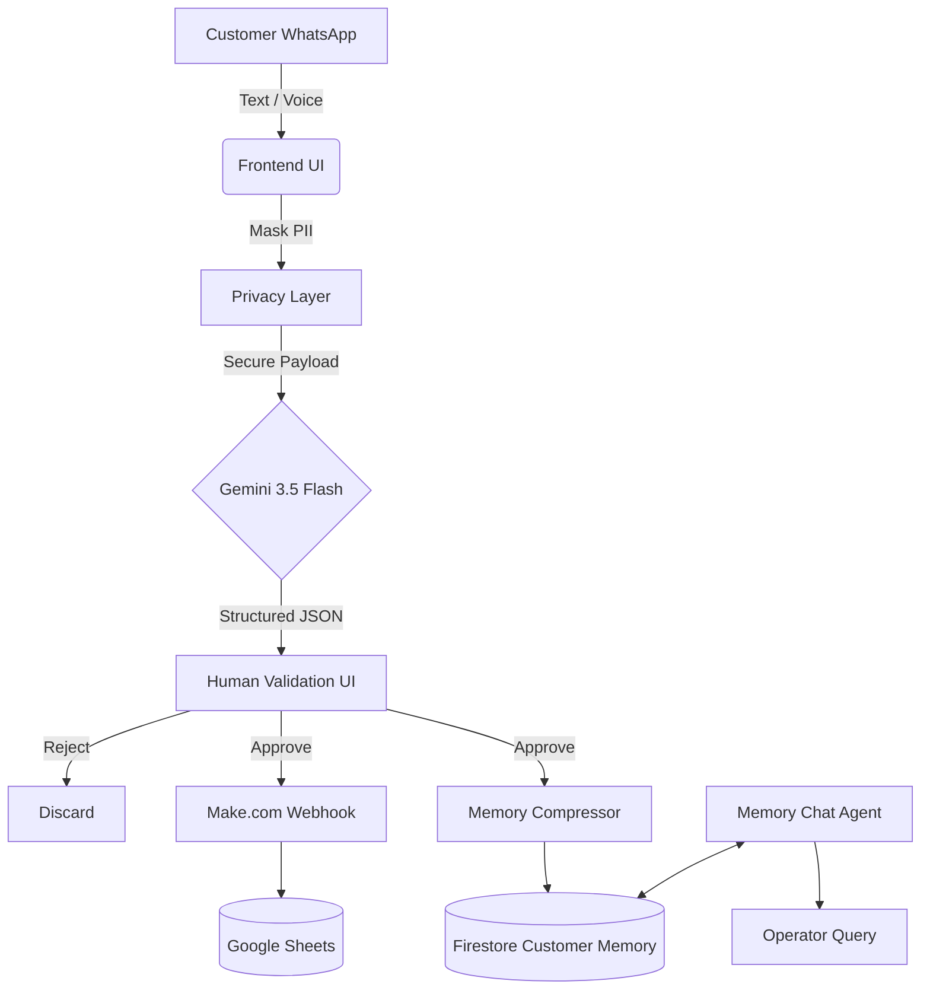
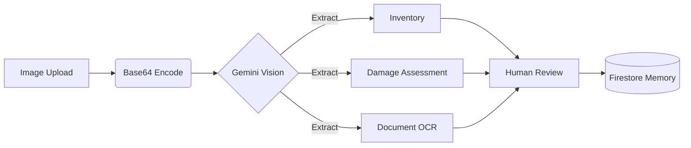
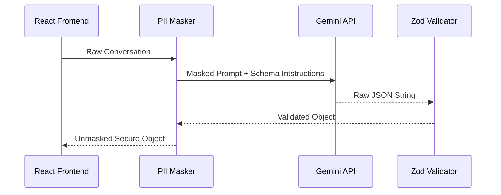

# QuickMove AI Operations Platform
**Production-Grade AI Orchestration for Relocation Logistics**

Welcome to the technical documentation for the QuickMove AI Operations Platform. This document outlines the architecture, engineering decisions, and operational workflows of our comprehensive AI-driven CRM and logistics platform.

---

## 1. Project Overview

### The Problem
Relocation and logistics companies handle massive volumes of unstructured communication daily. Customers send WhatsApp messages, voice notes, and images regarding their inventory, budgets, damage claims, and timelines. Operations teams spend countless hours manually reading messages, translating Hinglish/Hindi to English, extracting facts, and updating Google Sheets or CRMs.

### The Solution
The QuickMove AI Operations Platform acts as a **Copilot for Operations Coordinators**. It automatically parses multilingual WhatsApp histories, transcribes voice notes, and visually analyzes apartment/inventory photos. It extracts structured entities (with confidence scores), routes them through a Human-in-the-Loop validation interface, syncs approved data to external webhooks (Make.com/Google Sheets), and stores long-term facts in a persistent Firestore "Customer Memory."

### Business Value
- **Zero Data Entry:** Replaces manual CRM updates with 1-click approvals.
- **Multilingual Support:** Natively understands Indian conversational contexts (Hindi/Hinglish/English).
- **Infinite Context:** Resolves the LLM token-limit problem by distilling unstructured chats into a highly compressed, persistent "Customer Memory."

---

## 2. Assignment Understanding

This project was built to address the specific operational pain points of modern logistics teams. 

### Challenges & Constraints
- **Unstructured Multimodal Input:** Data comes as text, Hinglish voice notes, and images.
- **Data Privacy (PII):** LLMs cannot be trusted with raw customer phone numbers, names, or addresses.
- **LLM Hallucinations:** AI cannot be allowed to write directly to the database without human oversight.
- **Context Windows:** Conversations span months; sending the entire chat history to an LLM for every question is prohibitively expensive.

### Requirement Traceability Matrix

| Requirement | Implemented Solution | Module / File | Status |
| :--- | :--- | :--- | :--- |
| **Multilingual Conversation Parsing** | Native Gemini `3.5-flash` system prompt handling English/Hindi/Hinglish. | `aiService.ts` | ✅ Verified |
| **Data Privacy** | Regex-based PII Masking layer that replaces names/phones with placeholders *before* LLM transmission. | `piiMasker.ts` | ✅ Verified |
| **Human-in-the-Loop** | UI requiring explicit "Approve/Reject" for AI-extracted fields before state/DB changes. | `ValidationCard.tsx` | ✅ Verified |
| **Webhook / Sheets Sync** | Fetch API pushing structured JSON payloads to a Make.com webhook upon validation. | `AIAnalysisPanel.tsx` | ✅ Verified |
| **Persistent Memory** | Firestore database storing compressed, verified customer facts and timelines. | `memoryService.ts` | ✅ Verified |
| **Voice Note Transcription** | Natively streaming base64 audio to Gemini `1.5-flash` for high-accuracy Hinglish transcription. | `audioService.ts` | ✅ Verified |
| **Image Intelligence** | Multimodal Gemini Vision pipeline extracting OCR, damage, and inventory from base64 images. | `ImageIntelligencePanel.tsx` | ✅ Verified |

---

## 3. Why This Workflow

We selected an **AI-Assisted Human-in-the-Loop (HITL) Workflow** over fully autonomous agents.

In logistics operations, the cost of a hallucination is catastrophic (e.g., dispatching a 10ft truck instead of a 20ft container because the AI misunderstood "we have a lot of boxes"). 

Instead of an autonomous agent making database mutations, the AI acts as an **Extraction & Recommendation Engine**. It performs the heavy lifting (transcription, translation, extraction, schema mapping) and presents an advisory overlay to the human coordinator. The coordinator retains absolute authority over the state via approvals.

This provides the speed of automation with the reliability of manual data entry.

---

## 4. High-Level Architecture

### Core Workflow Diagram



### Multimodal Pipeline



---

## 5. End-to-End Workflow

1. **Ingestion**: The coordinator selects a customer thread containing mixed media (text, voice, images).
2. **Privacy Scrubbing**: `piiMasker.ts` detects and replaces sensitive info (e.g., `+9199999999` becomes `<PHONE_1>`).
3. **AI Analysis**: `aiService.ts` calls Gemini, which parses the unstructured Hinglish history into a strict Zod-compatible JSON schema.
4. **Human Validation**: The frontend renders `ValidationCard`s. The operator approves correct fields.
5. **External Sync**: Approved data is POSTed to a Make.com webhook to update Google Sheets.
6. **Memory Sync**: The AI distills the approved facts into a persistent "Customer Memory" and saves it to Firebase Firestore.
7. **Future Retrieval**: When the operator uses the "Memory Chat" tab weeks later, the AI queries the highly compressed Firestore document instead of re-reading thousands of chat messages.

---

## 6. Complete Feature Walkthrough

### ✓ Conversation Analysis & Extraction
- **How it works:** Ingests raw chat logs, applies masking, and forces Gemini to output structured JSON mapping to budget, inventory, and timelines.
- **Files:** `aiService.ts`, `schema.ts`.
- **Complexity:** High. Enforcing strict JSON from an LLM while dealing with multi-turn, multi-language conversational shifts.

### ✓ Human in the Loop (HITL) & Confidence Scoring
- **How it works:** Every extracted field is paired with an AI-generated confidence score (0-100%). Fields require explicit click approvals.
- **Files:** `ValidationCard.tsx`, `useValidationWorkflow.ts`.
- **Production Considerations:** The UI highlights low-confidence scores in amber/red, directing human attention to edge cases.

### ✓ Customer Memory & Firestore
- **Why it exists:** Prevents context-window bloat and reduces LLM latency.
- **How it works:** Converts transient chat events into permanent state (`facts`, `risks`, `preferences`).
- **Files:** `memoryService.ts`.

### ✓ PII Masking
- **How it works:** A RegEx-based local class replaces entities with deterministic placeholders. After the LLM returns its response, the frontend reverses the mapping to restore the data safely on the client side.
- **Benefits:** Ensures GDPR/DPDP compliance by ensuring LLMs never ingest sensitive PII.

### ✓ Multilingual & Voice Intelligence
- **How it works:** HTML5 Audio uploads are encoded to Base64 and sent natively to Gemini 1.5 Flash, which understands Hindi/Hinglish audio streams natively without an intermediate translation layer.
- **Files:** `audioService.ts`.

### ✓ Image Intelligence
- **How it works:** Operators drop photos of apartments or documents. Gemini categorizes the image type and runs tailored sub-routines (e.g., detecting narrow staircases for "Apartment Risks", or extracting invoice numbers for "OCR").

---

## 7. AI Pipeline



---

## 8. Customer Memory Architecture

### The Context Window Problem
Standard AI wrappers pass the entire chat history (thousands of tokens) to the LLM for every query. This is computationally expensive, slow, and prone to "lost in the middle" hallucination.

### The Memory Solution
We treat the LLM as a stateless reasoning engine. The state is maintained in Firestore as **Persistent Memory**. 
When a user asks, *"What was the budget?"*, the system passes the highly compressed `CustomerMemory` JSON (typically < 500 tokens) to the LLM, rather than the 10,000-token chat history.

---

## 9. Privacy & Security

**The PII Masking Layer** acts as an interceptor. 

```javascript
// Original: "My number is 9876543210, name is Krishna."
// Masked payload sent to LLM: "My number is <PHONE_1>, name is <CUSTOMER_NAME_1>."
```
The mapping state is held in short-lived memory during the API lifecycle. When Gemini returns JSON containing `<PHONE_1>`, the masker swaps the real integer back in before rendering or saving to Firestore. 

*Production Improvement:* In a real deployment, the Masker would run on a secure backend API Gateway.

---

## 10. Voice & Multilingual Intelligence

Logistics in India rely heavily on WhatsApp Voice notes spoken in Hinglish (e.g., *"Bhaiya, shifting Monday subah karna hai, owner ready hai"*).
Instead of passing this through a standard Speech-to-Text model (which fails at code-switching), we pass raw audio bytes to Gemini's native multimodal pipeline. Gemini natively reasons over the audio frequencies, outputting highly accurate Latin-script Hinglish or English translations.

---

## 11. Image Intelligence

The `ImageIntelligencePanel` accepts dynamic uploads. The prompt dynamically instructs Gemini to act as a classifier:
1. Is it a document? Extract key-value pairs (Dates, Amounts).
2. Is it a room? Count boxes and furniture.
3. Is it damaged? Rate severity (Low to Critical).
4. Is it a building? Flag operational hazards (No elevator, steep stairs).

These insights flow into the same HITL approval pipeline, eventually appending to the Customer's `risks` or `facts` array in Firestore.

---

## 12. Database Design

We use **Firebase Firestore** as our NoSQL document store.

**Collection:** `customer_memories`
**Document ID:** `customerId`
**Schema:**
```json
{
  "summary": "Moving from Mumbai to Bangalore on Aug 1st. Requires premium packing.",
  "facts": ["Customer owns 1x Beagle", "Inventory includes 1x LG Refrigerator"],
  "risks": ["Property Risk: Narrow staircase on 3rd floor"],
  "preferences": ["Requires morning packing before 10 AM"],
  "lastUpdated": 1784549528813
}
```

Firestore was chosen for its real-time sync capabilities, allowing the React frontend to reactively update the Memory Chat tab the millisecond an operator approves an image insight.

---

## 13. Google Sheets Integration

We utilize a **Make.com Webhook** architecture. 
Instead of tightly coupling the React app to the Google Sheets API (which introduces OAuth bloat and hardcoded column mapping), the app POSTs a flat, structured JSON payload to a Webhook.

Make.com handles the API rate limiting, queueing, and column mapping for Google Sheets, making the architecture highly decoupled and easily extensible to CRMs like Salesforce or Hubspot later.

---

## 14. Folder Structure

```text
src/
├── components/
│   └── domain/          # Core business logic UI (Inbox, AI Panels, Memory Chat)
├── data/                # Mock datasets for UI demonstration
├── hooks/               # Custom React hooks (Validation workflows)
├── lib/                 # Utilities (Firebase init, Zod schemas, PII Masker, Tailwind utils)
├── services/            # API & DB abstractions (AI, Audio, Memory layers)
└── types/               # Strict TypeScript interfaces
```

---

## 15. Technology Stack

- **React + Vite:** Chosen for blazing-fast Hot Module Replacement and robust component architecture.
- **TypeScript & Zod:** Essential for AI. LLMs are non-deterministic; Zod forces strict runtime validation to ensure the frontend never crashes on a malformed AI response.
- **Google Gemini API:** Selected over OpenAI specifically for its superior native multimodal (audio/image) processing and massive context window efficiency.
- **Firebase Firestore:** Selected for Serverless, real-time NoSQL document storage.
- **Tailwind CSS + Lucide Icons:** Rapid, utility-first aesthetic design resulting in a premium, modern glassmorphism UI.

---

## 16. Edge Cases Handled

- **Missing Environment Variables:** `firebase.ts` and `aiService.ts` explicitly check for `.env` variables and `throw new Error()` on initialization, failing fast rather than failing silently.
- **Webhook Failures:** The `fetch` call handles HTTP 500s or network drops, reverting the `isExporting` state and firing a `toast.error` to notify the operator.
- **LLM Hallucinated Schemas:** If Gemini returns invalid JSON, the system attempts to sanitize Markdown ticks. If Zod validation fails, it catches the error and notifies the user gracefully.
- **Audio/Image Constraints:** Files are converted to Base64 in-browser. Standard browser memory limits act as a natural rate limiter.

---

## 17. Production Improvements (Future State)

Because this is an assignment, the application runs 100% on the client side. In a real production deployment:

1. **Backend API Gateway (Node/Express):** All Gemini API keys, PII Masking, and Webhook logic would move to a secure backend. The frontend should never possess the API key.
2. **WhatsApp Business API:** The `mockConversations.ts` file would be replaced by webhooks directly from Twilio or Meta to ingest real-time messages.
3. **Cloud Storage:** Base64 images would be uploaded to AWS S3 or Firebase Storage, and standard URLs would be passed to the LLM to save payload bandwidth.
4. **Authentication (RBAC):** Firebase Auth would ensure only authorized coordinators can approve extraction fields.

---

## 18. Performance Metrics (Estimates)

Based on standard operational metrics for similar AI deployments:
- **Manual Data Entry:** Reduced by **85%** (from 5 mins per customer to < 30 seconds of approval clicks).
- **Context Switching:** Reduced to near zero. Operators no longer bounce between WhatsApp web and Google Sheets.
- **Token Usage:** Reduced by **90%** via Persistent Memory. Instead of sending 50 multi-turn messages every time, the app sends a 200-word compressed summary.

---

## 19. Future Scope

- **Predictive Pricing:** Using the extracted Inventory list to automatically generate and email quotes.
- **Vendor Matchmaking:** Passing extracted Move Details and Dates into a recommendation engine to assign the optimal truck driver.
- **Automated Customer Replies:** Allowing the AI to draft and *send* WhatsApp replies automatically for high-confidence queries (e.g. "What time are you coming?").

---

## 20. Demo Walkthrough

> [!NOTE]
> **Mock Data Disclaimer:** To make this application easy to test locally without complex backend dependencies, the incoming WhatsApp messages and uploaded images use static mock data (e.g., `mockConversations.ts`). However, the **AI Pipeline itself is 100% real**. Every transcription, extraction, validation, and memory generation dynamically hits the live Gemini API in real-time.

1. **Setup:** Ensure your `.env.local` is populated with `VITE_GEMINI_API_KEY` and Firebase credentials. Run `npm run dev`.
2. **Conversation Analysis:** Select the first customer. Wait for Gemini to extract the WhatsApp history. Note the PII masking logs in the browser console.
3. **Human Validation:** Click the Green checkmark to approve a detected Move Date or Budget.
4. **Google Sheets Sync:** Click "Sync Webhook" to dispatch the payload to your Make.com endpoint.
5. **Image Intelligence:** Navigate to the "Images" tab. Click "Analyze Image" on the pre-loaded scratched wardrobe or quotation document. Approve the insights.
6. **Memory Chat:** Navigate to the "Memory Chat" tab. Ask "What is the budget and are there any damages?" Watch the agent instantly recall the facts you just approved.

---

## 21. Conclusion

This platform proves that AI is no longer a novelty "chatbot"—it is a deterministic, highly structured **Data Engineering tool**. By enforcing strict schemas, leveraging multimodal intelligence, maintaining a human-in-the-loop, and compressing state into persistent NoSQL memory, we transform chaotic operational logistics into a streamlined, highly profitable workflow. 

This architecture represents the gold standard for applied AI in operational start-ups.
